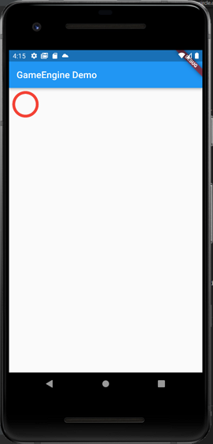

#  Flutter GameEngine의 소개

## 개요

다용도로 사용할 수 있는 아주 가벼운 게임 엔진입니다.
특수 목적의 Flutter Custom Widget을 개발하다가 만들어진 라이브러리입니다.

> 현재(2022.01.13) 아애와 같은 기능들이 구현되지 않은 상태입니다.
> * 해상도에 영향 받지 않는 좌표계 처리
> * HitArea는 기본 영역으로 대체해서 처리
> * 메시지 루프에 의한 이벤트 버스 구현 안됨


## Class Diagram


* GameEngine
  * 게임 엔진 메인 클래스
  * 스케쥴링, 페인팅 및 제스쳐 처리를 담당합니다.
* GameControl
  * 화면에 표시되는 클래스의 인터페이스를 제공합니다.
  * 콤포지트 패턴으로 처리되어 있어 ConcreteGameControl, GameControlGroup 클래스와 한 세트입니다.
* HitArea
  * GameControl 객체들끼리 겹쳐지는 지를 확인하기 위한 영역 설정을 합니다.
  * HitArea가 지정되지 않으면 디폴트로 GameControl의 영역(x, y, width, height)을 기준으로 판정합니다.
* Scheduler
  * GameEngine의 반복적인 프로세스를 처리하기 위한 스케쥴러
* GamePainter
  * GameControl의 그래픽 처리를 위한 클래스
* GameMessages
  * 이벤트 버스 형식의 메시지 처리


## Job Flow


* 제스쳐 등 기본적인 요소들은 생략하였습니다
* Scheduler의 tick 이벤트는 GameEngine.start() 이후 지속적으로 발생합니다.
  * GameControlGroup을 통해서 모든 GameControl의 tick 메소드를 실행시켜서 스케쥴링 작업을 진행합니다. (그리기 포함)
* tick 이벤트의 배치 작업
  * 동기화 작업을 위해서 tick 테스크 처리 이후 전체 객체를 대상으로 배치처리를 합니다.
  * processMessages
    * tick 한 주기 동안 쌓인 메시지를 실제 버퍼로 옮깁니다.
  * deleteObjects
    * tick 테스트 처리하는 동안 삭제 표시가 된 객체들을 실제로 삭제합니다.
    * tick 이벤트 내에서 갑자기 객체가 사라지면 논리적 오류가 발생 할 수 있습니다.
  * moveObjects
    * sendToBack, bringToFront 실체 처리를 합니다.


## 기본 사용법


### main.dart

``` dart
void main() => runApp(MyApp());

class MyApp extends StatelessWidget {
  const MyApp({Key? key}) : super(key: key);

  @override
  Widget build(BuildContext context) {
    return MaterialApp(
      title: 'GameEngine Demo',
      theme: ThemeData(
        primarySwatch: Colors.blue,
      ),
      home: MyHomePage(),
    );
  }
}

class MyHomePage extends StatelessWidget {
  MyHomePage({Key? key}) : super(key: key) {
    _gameEngine.getControls().addControl(SimpleCircle());
    _gameEngine.start();
  }

  @override
  Widget build(BuildContext context) {
    return Scaffold(
      appBar: AppBar(
        title: const Text("GameEngine Demo"),
      ),
      body: SizedBox(
        width: double.infinity,
        height: double.infinity,
        child: _gameEngine.getCustomPaint()
      )
    );
  }

  final _gameEngine = GameEngine();
}
```
* 38: GameEngine 클래스의 인스턴스를 생성합니다.
* 19-22: MyHomePage의 생성자에서 GameEngine을 초기화 합니다.
  * 20: 게임엔진이 처리할 SimpleCircle의 인스턴스를 생성해서 추가합니다.
  * 21: 게임엔진을 시작합니다.
* 30-34: 화면의 body 부분에 게임엔진 위젯을 덮어 씌웁니다. 참고로 게임엔진은 CustomPaint를 이용해서 만들어 져 있습니다.


### simple_circle.dart

``` dart
class SimpleCircle extends GameControl {
  SimpleCircle() {
    x = 10;
    y = 10;
    width = 50;
    height = 50;
    paint.color = Colors.red;
    paint.style = PaintingStyle.stroke;
    paint.strokeWidth = 6.0;
  }

  @override
  void tick(Canvas canvas, int current, int term) {
    canvas.drawCircle(Offset(x + width / 2, y + height / 2), width / 2, paint);
  }
}
```
화면에 원을 그리는 게임 컨트롤의 예제입니다.
* 2-10: SimpleCircle의 초기화 부분입니다.
  * 3-4: x, y는 인스턴스의 좌표입니다.
  * 5-6: width, height는 인스턴스의 크기입니다.
  * paint는 Canvas의 그리기에 필요한 인스턴스로 색상 등의 속성들을 지정하게 됩니다.
* 12-15: 게임엔진이 주기적으로 모든 게임 컨트롤 인스턴스의 tick() 메소드를 실행하게 됩니다.
  그리기 및 각 객체의 논리적인 구현은 이 메소드를 통해서 처리하면 됩니다.
  * 14: canvas의 drawCircle() 메소드를 이용해서 원을 그립니다.


### 실행결과




## 간단한 애니메이션 처리

### main.dart

``` dart
...
class MyApp extends StatelessWidget {
  ...
  @override
  Widget build(BuildContext context) {
    ...
  }
}

class MyHomePage extends StatelessWidget {
  MyHomePage({Key? key}) : super(key: key) {
    _gameEngine.getControls().addControl(AnimatedCircle());
    _gameEngine.start();
  }

  @override
  Widget build(BuildContext context) {
    ...
  }
  ...
}
```
* 12: 애니메이션 처리를 위하여 생성한 AnimatedCircle 클래스의 인스턴스를 추가하는 코드만 변경하시면 됩니다.


### animated_circle.dart

``` dart
class AnimatedCircle extends GameControl {
  AnimatedCircle() {
    x = 100;
    y = 10;
    width = 50;
    height = 50;
    paint.color = Colors.red;
    paint.style = PaintingStyle.fill;
  }

  @override
  void tick(Canvas canvas, int current, int term) {
    var radius = (width / 2)  + 6 * sin(current / 500);
    canvas.drawCircle(Offset(x + width / 2, y + height / 2), radius, paint);
  }
}
```
* 8: 원을 채워서 그리기 위해서 fill 옵션을 사용중입니다.
* 11-15: 게임엔진이 주기적으로 모든 게임 컨트롤 인스턴스의 tick() 메소드를 실행하게 됩니다.
  * current: 게임엔진이 시작된 이후로 지난 시간이 밀리초 단위로 전달됩니다.
  * term: 바로 이전에 tick()이 실행 된 이후 지난 시간이 밀리초 단위로 전달됩니다.
  * 13: 원의 크기를 sin() 함수를 이용해서 시간의 흐름 따라 변경합니다.
  * 14: canvas의 drawCircle() 메소드를 이용해서 원을 그립니다.


### 실행결과


## Drag & Drop

### main.dart

``` dart
...
class MyApp extends StatelessWidget {
  ...
  @override
  Widget build(BuildContext context) {
    ...
  }
}

class MyHomePage extends StatelessWidget {
  MyHomePage({Key? key}) : super(key: key) {
    _gameEngine.getControls().addControl(BoxControl());
    _gameEngine.start();
  }

  @override
  Widget build(BuildContext context) {
    ...
  }
  ...
}
```
* 12: 애니메이션 처리를 위하여 생성한 BoxControl 클래스의 인스턴스를 추가하는 코드만 변경하시면 됩니다.


### box_control.dart

``` dart
class BoxControl extends GameControl {
  BoxControl() {
    x = 200;
    y = 200;
    width = 50;
    height = 50;
    paint.color = Colors.blue;
    paint.style = PaintingStyle.stroke;
    paint.strokeWidth = 6.0;
  }

  @override
  void tick(Canvas canvas, int current, int term) {
    canvas.drawRect(Rect.fromLTRB(x, y, x + width, y + height), paint);
  }

  @override
  void onHorizontalDragStart(DragStartDetails details) {
    bringToFront();
  }

  @override
  void onHorizontalDragUpdate(DragUpdateDetails details) {
    x = details.localPosition.dx - startX;
    y = details.localPosition.dy - startY;
  }
}
```
* 17-20: onHorizontalDragStart()는 BoxControl 인스턴스의 위치에서 터치가 시작되면 실행되는 메소드입니다.
  * 19: 여러 인스턴스가 겹쳐 있으면 가장 위에 있는 인스턴스만 선택됩니다. 선택된 객체를 맨 앞으로 표시하도록 합니다.
* 22-26: onHorizontalDragUpdate()는 터치 이후 위치가 이동되면 실행되는 메소드입니다.
  * 24-25: 현재의 터치된 위치에서 처음 터치한 위치의 값을 뺀만큼 이동한 것이 됩니다.


### 실행결과


## 충돌 테스트

### main.dart

``` dart
...
class MyApp extends StatelessWidget {
  ...
  @override
  Widget build(BuildContext context) {
    ...
  }
}

class MyHomePage extends StatelessWidget {
  MyHomePage({Key? key}) : super(key: key) {
    _gameEngine.getControls().addControl(BoxControl());
    _gameEngine.getControls().addControl(CircleControl());
    _gameEngine.start();
  }

  @override
  Widget build(BuildContext context) {
    ...
  }
  ...
}
```
* 13: 애니메이션 처리를 위하여 생성한 CircleControl 클래스의 인스턴스를 추가하는 코드를 추가합니다.


### circle_control.dart

``` dart
class CircleControl extends GameControl {
  CircleControl() {
    x = 100;
    y = 100;
    width = 50;
    height = 50;
    paint.color = Colors.greenAccent;
    paint.style = PaintingStyle.stroke;
    paint.strokeWidth = 6.0;
  }

  @override
  void tick(Canvas canvas, int current, int term) {
    paint.color = Colors.greenAccent;
    canvas.drawCircle(Offset(x + width / 2, y + height / 2), width / 2, paint);

    if (_dragging) {
      paint.color = Colors.grey;
      var center = Offset(_dragX + width / 2, _dragY + height / 2);
      canvas.drawCircle(center, width / 2, paint);
    }
  }

  void onHorizontalDragStart(DragStartDetails details) {
    bringToFront();
    _dragging = true;
  }

  void onHorizontalDragUpdate(DragUpdateDetails details) {
    _dragX = details.localPosition.dx - startX;
    _dragY = details.localPosition.dy - startY;
  }

  void onHorizontalDragEnd(DragEndDetails details) {
    _dragging = false;

    x = _dragX;
    y = _dragY;

    List<GameControl> list = checkCollisions();
    for (var control in list) {
      control.deleted = true;
    }
  }

  double _dragX = 0;
  double _dragY = 0;
  bool _dragging = false;
}
```
기본적으로는 BoxControl과 유사합니다. 다른 점에 대해서 설명합니다.
* 17-21: 이둥 중인 경우에는 회색으로 표시해서 드래그 중인 것을 알 수 있도록 하고 있습니다.
  실제 원은 계속 그대로 표시되고 회색 원이 새로 나타나서 현재의 위치에 표시 됩니다.
* 26: 드래그가 시작되는 것을 _dragging 플래그를 이용해서 구별하도록 합니다.
* 35: 드래그를 중단합니다.
* 37-38: 드래그 된 위치로 현재 위치를 변경합니다.
  실제 원의 위치가 이제야 변경됩니다.
* 40-43: 현재 인스턴스와 충돌된 모든 인스턴스를 불러옵니다.
  * 42: 충돌한 인스터스의 deleted를 true로 변경하면 게임엔진에 의해서 삭제됩니다.


### 실행결과


