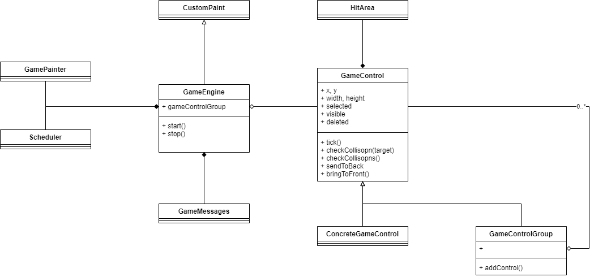
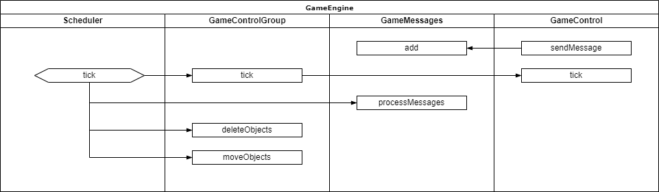

# 게임엔진 구조 설명

## Class Diagram

* GameEngine
  * 게임 엔진 메인 클래스
  * 스케쥴링, 페인팅 및 제스쳐 처리를 담당합니다.
* GameControl
  * 화면에 표시되는 클래스의 인터페이스를 제공합니다.
  * 콤포지트 패턴으로 처리되어 있어 ConcreteGameControl, GameControlGroup 클래스와 한 세트입니다.
* HitArea
  * GameControl 객체들끼리 겹쳐지는 지를 확인하기 위한 영역 설정을 합니다.
  * HitArea가 지정되지 않으면 디폴트로 GameControl의 영역(x, y, width, height)을 기준으로 판정합니다.
* Scheduler
  * GameEngine의 반복적인 프로세스를 처리하기 위한 스케쥴러
* GamePainter
  * GameControl의 그래픽 처리를 위한 클래스
* GameMessages
  * 이벤트 버스 형식의 메시지 처리

## Job Flow

* 제스쳐 등 기본적인 요소들은 생략하였습니다
* Scheduler의 tick 이벤트는 GameEngine.start() 이후 지속적으로 발생합니다.
  * GameControlGroup을 통해서 모든 GameControl의 tick 메소드를 실행시켜서 스케쥴링 작업을 진행합니다. (그리기 포함)
* tick 이벤트의 배치 작업
  * 동기화 작업을 위해서 tick 테스크 처리 이후 전체 객체를 대상으로 배치처리를 합니다.
  * processMessages
    * tick 한 주기 동안 쌓인 메시지를 실제 버퍼로 옮깁니다.
  * deleteObjects
    * tick 테스트 처리하는 동안 삭제 표시가 된 객체들을 실제로 삭제합니다.
    * tick 이벤트 내에서 갑자기 객체가 사라지면 논리적 오류가 발생 할 수 있습니다.
  * moveObjects
    * sendToBack, bringToFront 실체 처리를 합니다.
