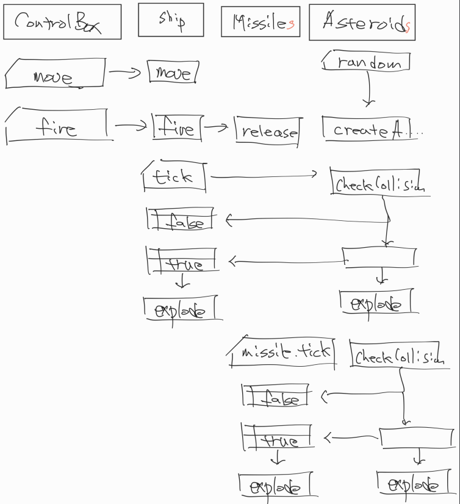

# 슈팅 게임만들기 #1

## 학습목표
* 요구사항 분석
* 인터페이스 계층 설계
* 인터페이스 계층 구현

## 화면 설계

## PBS
* Ship
  * 이동 (좌, 우)
  * Missile 발생
  * 충돌 검사
  * 폭파
* Missile
    * 이동 (up, 지속적인 전진)
    * 충돌 검사
    * 폭파
* Asteroid
    * 이동 (down, 지속적인 전진)
    * 충돌 검사
    * 폭파

## Job Flow

