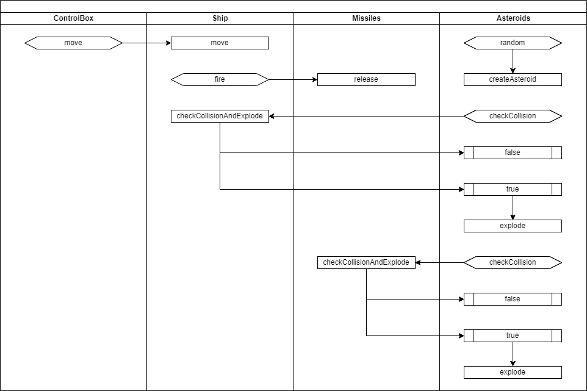

# 슈팅 게임만들기 #1

## 학습목표
* 요구사항 분석
* 인터페이스 계층 설계

## 화면 설계

쉽고 빠르게 예제를 따라할 수 있도록 모든 게임 컨트롤은 동그라미로 표현하겠습니다.

## PBS (Process Breakdown Structure)

이 실습에서 완성하려고 하는 게임의 목표는 아래와 같습니다.

* Ship
  * 이동 (좌, 우)
  * Missile 발생
  * 충돌 검사
  * 폭파
* Missile
    * 이동 (up, 지속적인 전진)
    * 충돌 검사
    * 폭파
* Asteroid
    * 이동 (down, 지속적인 전진)
    * 충돌 검사
    * 폭파

## Job Flow

