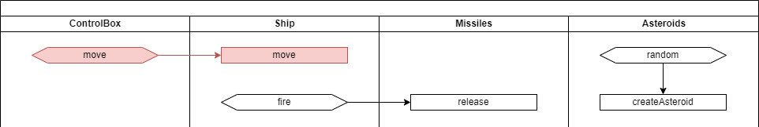

# 슈팅 게임만들기 #2


## 학습목표

* 조이스틱(Joystick)을 클릭하면 우주선(Ship)이 왼쪽으로 이동하도록 하는 과정까지만 구현합니다.
* 설계 내용을 토대로 인터페이스 계층을 우선 처리하고, 구현 계층으로 넘어가는 과정을 배웁니다.




## 인터페이스 계층

### ship.dart

``` dart
import 'package:flutter/material.dart';
import '../../game_engine.dart';

class Ship extends GameControl {
  void move(int direction) {
    //
  }
}
```

### joystick.dart

``` dart
import 'package:flutter/material.dart';
import '../../game_engine.dart';

typedef MoveCallback = void Function(int direction);

class Joystick extends GameControl {
  final MoveCallback onMove;

  Joystick({required this.onMove});
}
```

### space_ship.dart

``` dart
import 'package:flutter/material.dart';
import '../../game_engine.dart';
import 'joystick.dart';
import 'ship.dart';

class SpaceShip extends StatelessWidget {
  SpaceShip({Key? key}) : super(key: key) {
    _joystick = Joystick(
        onMove: (int direction) => {
          _ship.move(direction)
        }
    );

    _ship = Ship();

    _gameEngine.getControls().addControl(_joystick);
    _gameEngine.getControls().addControl(_ship);
    _gameEngine.start();
  }

  @override
  Widget build(BuildContext context) {
    return Scaffold(
        appBar: AppBar(
          title: const Text("GameEngine Demo"),
        ),
        body: SizedBox(
            width: double.infinity,
            height: double.infinity,
            child: _gameEngine.getCustomPaint()
        )
    );
  }

  final _gameEngine = GameEngine();
  late final _joystick;
  late final _ship;
}
```


## 구현 계층

전체적인 흐름은 완성되었기 때문에 이제 개별 클래스(모듈) 구현에만 집중하면 됩니다.
인터페이스 계층을 나눴기 때문에 개별 클래스를 작업할 때 외부의 정보를 전혀 알 필요가 없는 것이 가장 큰 장점입니다.
즉, 시스템을 분할하여 작은 단위로 나누고 나눠진 부분에만 집중하면 되는 것입니다.

### ship.dart

``` dart
import 'package:flutter/material.dart';
import 'package:temp/game_engine.dart';

const SHIP_SIZE = 60.0;

class Ship extends GameControl {
  @override
  void onStart(Canvas canvas, Size size, int current) {
    width = SHIP_SIZE;
    height = SHIP_SIZE;
    x = (size.width - width) / 2;
    y = size.height - SHIP_SIZE * 2;
    paint.color = Colors.blue;
  }

  @override
  void tick(Canvas canvas, Size size, int current, int term) {
    x = x + _direction;

    const radius = SHIP_SIZE / 2;
    canvas.drawCircle(Offset(x + radius, y + radius), radius, paint);
  }

  void move(int direction) {
    _direction = direction;
  }

  int _direction = 0;
}
```

### joystick.dart

``` dart
import 'package:flutter/material.dart';
import '../../game_engine.dart';

const BUTTON_SIZE = 60.0;
const BUTTON_POSITION_LEFT = -1;
const BUTTON_POSITION_RIGHT = 1;

typedef MoveCallback = void Function(int direction);

class Joystick extends GameControl {
  final MoveCallback onMove;

  Joystick({required this.onMove});

  @override
  void onStart(Canvas canvas, Size size, int current) {
    x = 20;
    y = size.height - BUTTON_SIZE * 2;
    width = BUTTON_SIZE;
    height = BUTTON_SIZE;
    paint.color = Colors.red.withOpacity(0.1);
  }

  @override
  void tick(Canvas canvas, Size size, int current, int term) {
    const radius = BUTTON_SIZE / 2;
    canvas.drawCircle(Offset(x + radius, y + radius), radius, paint);
  }

  @override
  void onHorizontalDragStart(DragStartDetails details) {
    onMove(BUTTON_POSITION_LEFT);
  }

  @override
  void onHorizontalDragEnd(DragEndDetails details) {
    onMove(0);
  }
}
```