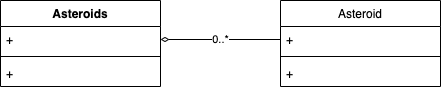

# 슈팅 게임만들기 #3


## 학습목표

* 소행성을 떨어트려서 게임 컨트롤을 움직이는 효과를 연습합니다.


## Job Flow


## Class Diagram




## Asteroids 구현 (asteroids.dart)

``` dart
...
class Asteroids extends GameControl {
  @override
  void tick(Canvas canvas, Size size, int current, int term) {
    _term = _term + term;
    while (_term >= _relaseInterval) {
      _term = _term - _relaseInterval;
      _createAsteroid(size);
    }
  }

  void _createAsteroid(Size size) {
    var _x = _random.nextDouble() * (size.width - ASTEROID_SIZE);
    getGameControlGroup()?.addControl(Asteroid(_x, 0));
  }

  int _relaseInterval = 500;
  int _term = 0;
  var _random = Random();
}
```


## Asteroid 구현 (asteroids.dart)

### 소행성 표시하기

``` dart
...
class Asteroids extends GameControl {
  ...
}

const ASTEROID_SIZE = 30.0;

class Asteroid extends GameControl {
  Asteroid(double ax, double ay)
  {
    x = ax;
    y = ay;
    width = ASTEROID_SIZE;
    height = ASTEROID_SIZE;
    paint.color = Colors.red;
  }

  @override
  void tick(Canvas canvas, Size size, int current, int term) {
    const radius = ASTEROID_SIZE / 2;
    canvas.drawCircle(Offset(x + radius, y + radius), radius, paint);
  }
}
```

### 소행성 떨어트리기

``` dart
...
class Asteroids extends GameControl {
  ...
}

const ASTEROID_SIZE = 30.0;

class Asteroid extends GameControl {
  Asteroid(double ax, double ay)
  {
    ...
  }

  @override
  void tick(Canvas canvas, Size size, int current, int term) {
    y = y + _speed;
    if (y > size.height) deleted = true;
    ...
  }

  double _speed = 2;
}
```
