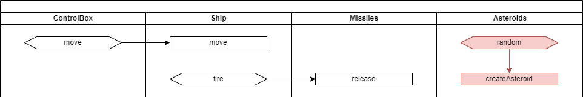
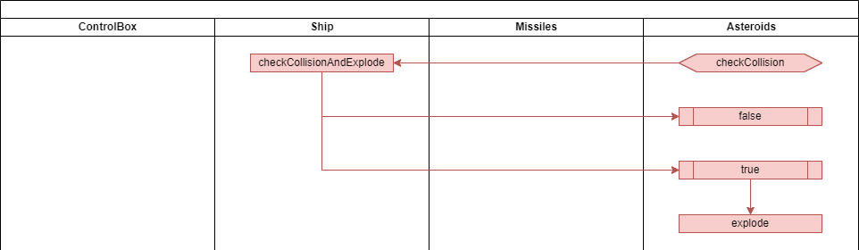

# 슈팅 게임만들기 #3


## 학습목표

* 소행성을 떨어트려서 게임 컨트롤을 움직이는 효과를 연습합니다.
* 게임 컨트롤 끼리 충돌했는 지를 확인하고 처리하는 방법을 배웁니다.


## 소행성 떨어트리기



### asteroids.dart

``` dart
import 'dart:math';
import 'package:flutter/material.dart';
import '../../game_engine.dart';

const ASTEROID_SIZE = 30.0;

class Asteroids extends GameControl {
  @override
  void tick(Canvas canvas, Size size, int current, int term) {
    _term = _term + term;
    while (_term >= _relaseInterval) {
      _term = _term - _relaseInterval;
      _createAsteroid(size);
    }
  }

  void _createAsteroid(Size size) {
    var _x = _random.nextDouble() * (size.width - ASTEROID_SIZE);
    getGameControlGroup()?.addControl(Asteroid(_x, 0));
  }

  int _relaseInterval = 500;
  int _term = 0;
  var _random = Random();
}

class Asteroid extends GameControl {
  Asteroid(double ax, double ay)
  {
    x = ax;
    y = ay;
    width = ASTEROID_SIZE;
    height = ASTEROID_SIZE;
    paint.color = Colors.red;
  }

  @override
  void tick(Canvas canvas, Size size, int current, int term) {
    y = y + _speed;
    if (y > size.height) deleted = true;

    const radius = ASTEROID_SIZE / 2;
    canvas.drawCircle(Offset(x + radius, y + radius), radius, paint);
  }

  double _speed = 2;
}
```

## 소행성 충돌 테스트



### asteroids.dart

``` dart
...
typedef CheckCollisionCallback = bool Function(GameControl target);

class Asteroids extends GameControl {
  final CheckCollisionCallback onCheckCollision;

  Asteroids({required this.onCheckCollision});

  void _createAsteroid(Size size) {
    var _x = _random.nextDouble() * (size.width - ASTEROID_SIZE);
    getGameControlGroup()?.addControl(Asteroid(_x, 0, onCheckCollision));
  }
  ...
}

class Asteroid extends GameControl {
  Asteroid(double ax, double ay, CheckCollisionCallback onCheckCollision)
  {
    ...
    _onCheckCollision = onCheckCollision;
  }

  @override
  void tick(Canvas canvas, Size size, int current, int term) {
    ...
    if (_onCheckCollision != null) {
      if (_onCheckCollision!(this)) deleted = true;
    }
  }

  double _speed = 2;
  CheckCollisionCallback? _onCheckCollision;
}
```

### ship.dart

``` dart
...
class Ship extends GameControl {
  ...
  bool checkCollisionAndExplode(GameControl target) {
    var result = checkCollision(target);
    if (result) deleted = true;
    return result;
  }
  ...
}
```
